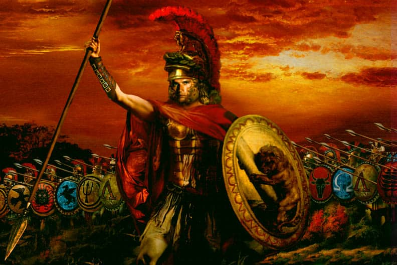

# Alexander

Alexander III of Macedon, commonly known as Alexander the Great, was a king of the ancient Greek kingdom of Macedon. He succeeded his father Philip II to the throne in 336 BC at the age of 20, and spent most of his ruling years conducting a lengthy military campaign throughout Western Asia and Northeastern Africa.

