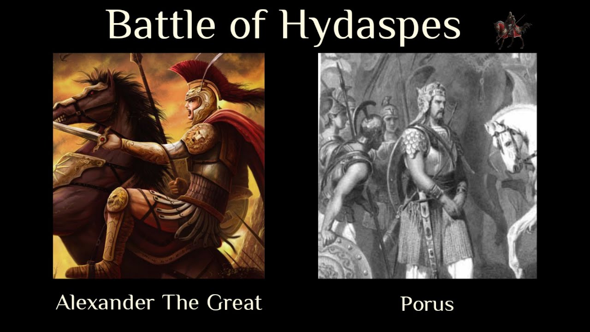

# Docs-as-Code-TWTSesssion
Demo repo for practicing Docs-as-code approach
## Overview
We had wonderful sessions on _docs as code_
The session began with all memebers **introducing** each other.
The trainer covered various topics and all sessions were interactive.
There were 4 sessions that were conducted on two weekends.

### Alexander and Porus
Alexander invaded India in {{page.year}}
Porus put up a tough fight and the year {{page.year}} is known after {{site.author}} and Porus. 
{{site.author}} was known as an emperor who wished to invade the whole world.

See the following image:


- {{ item.name }}, {{item.year}}


Imagine a set of machines in a production line. An individual machine is a Thing. The production line may also be a Thing that consists of individual machines.
Although it is not a requirement to include the production line as a Thing in your model, it may be useful if there is important production line level data within your application requirements.
In this scenario, you would model production line data as properties within the production line Thing, allowing you to effortlessly include those objects in dashboards and mashups.
Additionally, you could represent a plant as a Thing to use as a roll up for production data across an entire plant. Another use case might involve assets (leased machines, equipment capable of providing remote service and diagnostics or even distributed equipment like the power distribution equipment for an electrical utility) deployed at different locations. You could model each entity as a Thing along with its location and track a number of data attributes. Then, plot them on a map and track status, location, and movement.

