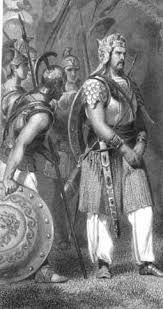

#Porus
Porus was an ancient Indian king, whose territory spanned the region between the Jhelum River (Hydaspes) and Chenab River (Acesines), in the Punjab region of the Indian subcontinent. He is only mentioned in Greek sources.
Credited to have been a legendary warrior with exceptional skills, Porus unsuccessfully fought against Alexander the Great in the Battle of the Hydaspes (326 BC). In the aftermath, an impressed Alexander not only reinstated him as his satrap but also granted him dominion over lands to the south-east extending until the Hyphasis (Beas). Porus reportedly died sometime between 321 and 315 BC.

